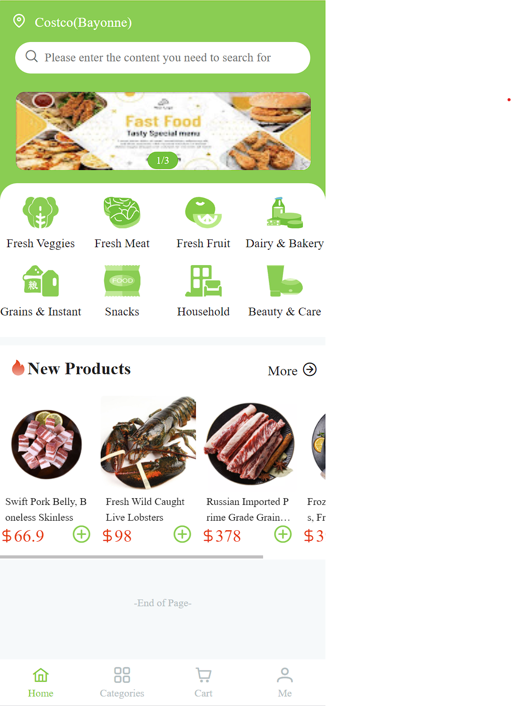

# React Shopping Application

**Role**: Front-End Developer

**Technologies**: React, TypeScript, TailwindCSS, Webpack, Babel, Axios, Jest, Charles Proxy, LocalStorage

---

## Project Description

The React Shopping Application is a dynamic and responsive e-commerce platform developed using React and TypeScript. It allows users to browse through a catalog of products, add items to their shopping cart, and proceed through a seamless checkout process. The project is built with modern web technologies, ensuring both performance and maintainability.

---

## Key Responsibilities and Achievements

- **Front-End Development**: Designed and implemented the user interface using React and TypeScript, leveraging the power of TailwindCSS for styling. The components were developed with a focus on reusability and responsiveness.

- **State Management**: Utilized React's built-in state management to handle the application's data flow, including product listings, shopping cart management, and user sessions.

- **Routing**: Implemented client-side routing using React Router, allowing for smooth navigation between different views like product listing, product details, and the shopping cart.

- **API Integration with Charles Proxy**: Simulated backend JSON APIs using Charles Proxy. This allowed me to mock and test API responses for various features such as product listing, product details retrieval, and the checkout process. The use of Charles Proxy also facilitated testing of different scenarios, such as location-based services, by intercepting network requests and modifying JSON responses accordingly.

- **LocalStorage for State Persistence**: Integrated LocalStorage to persist user data, such as the shopping cart contents, across sessions. This ensured that users could return to the application and continue where they left off without losing their selected items.

- **Testing**: Implemented unit tests using Jest and the React Testing Library to ensure the reliability of the application. This included testing individual components as well as full integration tests for key user flows.

- **Performance Optimization**: Configured Webpack and Babel to optimize the build process, reducing bundle sizes and improving load times. Applied code-splitting and lazy loading techniques for better performance.

- **Development Environment Setup**: Configured TypeScript and Webpack to create a robust development environment, ensuring type safety and smooth builds. Managed dependencies and scripts via npm and yarn, simplifying the development workflow.

- **Version Control**: Managed project codebase using Git and GitHub, following best practices for commits and branching strategies to ensure collaborative efficiency and maintain code integrity.

---

## Tools and Technologies

- **React & TypeScript**: Developed the entire front-end with a focus on type safety, reusability, and component-driven architecture.
- **TailwindCSS**: Utilized TailwindCSS for fast and efficient styling, enabling a responsive and modern UI.
- **Webpack & Babel**: Configured Webpack and Babel for module bundling and transpiling, ensuring compatibility across different browsers.
- **Axios**: Used Axios for making HTTP requests to the mocked backend APIs, enabling seamless data retrieval and submission.
- **Charles Proxy**: Simulated backend JSON interfaces using Charles Proxy, enabling comprehensive testing of API interactions, including location-based services and other dynamic content.
- **LocalStorage**: Implemented LocalStorage for persisting user data across sessions, enhancing the user experience by retaining their shopping cart items.
- **Jest**: Wrote and executed unit and integration tests with Jest, ensuring the robustness and reliability of the application.
- **Git & GitHub**: Utilized Git for version control and GitHub for project management and collaboration.

---

## Visual Walkthrough

Here are some screenshots of the application that highlight its main features:

- **Cart Page**:
  
*The Cart Page allows users to review items in their cart, adjust quantities, and proceed to checkout.*

- **Category Page**:
  

- **Home Page**:
  

- **Product Details Page**:
  

- **Sign-Up Page**:
  

---

This project demonstrates my ability to develop a complete front-end application from scratch, simulate and test backend interactions using Charles Proxy, and manage state and data persistence effectively. The use of modern web development tools and techniques highlights my proficiency in building responsive, high-performance applications.
